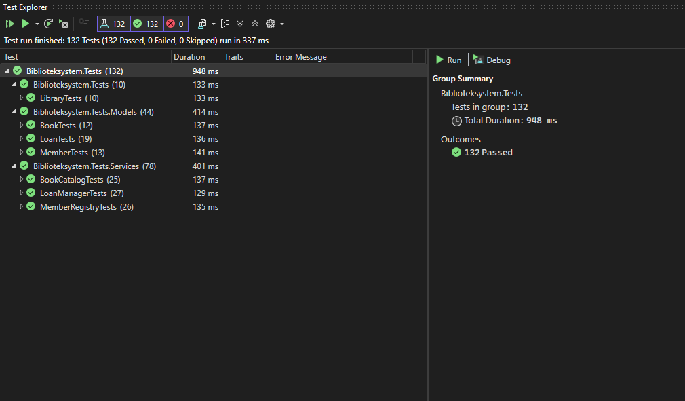

# 📚 Bibliotekssystem

Ett bibliotekshanteringssystem med konsolapp (Del 1) och webbgränssnitt (Del 2), byggt med .NET 9, Blazor Server och Entity Framework Core.

---

## Del 2 — Webbapplikation (Blazor + EF Core)

### Projektstruktur

```
Bibliotekssystem/
├── Bibliotekssystem/              # Konsolapplikation (Del 1)
├── Bibliotekssystem.Core/         # Modeller och interfaces
├── Bibliotekssystem.Data/         # Entity Framework, DbContext, Repositories
├── Bibliotekssystem.Web/          # Blazor Server webbgränssnitt
└── Biblioteksystem.Tests/         # Enhetstester (xUnit + bUnit)
```

### Kom igång

#### Krav
- .NET 9 SDK
- Visual Studio 2022/2025

#### Starta projektet
1. Klona repot
2. Öppna `Bibliotekssystem.sln` i Visual Studio
3. Sätt **Bibliotekssystem.Web** som startprojekt
4. Tryck **F5**

Databasen (`library.db`) skapas automatiskt vid första körningen med startdata (15 böcker, 8 medlemmar och 8 lån).

#### Köra tester
Öppna Test Explorer i Visual Studio eller kör:
```
dotnet test
```

### Databasschema

SQLite-databas med tre tabeller:

```
┌──────────────────────┐       ┌──────────────────────┐
│       Books          │       │      Members         │
├──────────────────────┤       ├──────────────────────┤
│ Id (PK)              │       │ Id (PK)              │
│ ISBN (UNIQUE)        │       │ MemberId (UNIQUE)    │
│ Title                │       │ Name                 │
│ Author               │       │ Email (UNIQUE)       │
│ PublishedYear        │       │ MemberSince          │
│ IsAvailable          │       │                      │
└──────────┬───────────┘       └──────────┬───────────┘
           │ 1:N                          │ 1:N
           │                              │
       ┌───┴──────────────────────────────┴───┐
       │              Loans                    │
       ├───────────────────────────────────────┤
       │ Id (PK)                               │
       │ BookId (FK → Books)                   │
       │ MemberId (FK → Members)               │
       │ LoanDate                              │
       │ DueDate                               │
       │ ReturnDate (nullable)                 │
       └───────────────────────────────────────┘
```

#### Relationer
- **Book → Loans**: En bok kan ha många lån (1:N)
- **Member → Loans**: En medlem kan ha många lån (1:N)
- **DeleteBehavior.Restrict**: Böcker/medlemmar med aktiva lån kan inte tas bort

#### Constraints
- `Books.ISBN` — unikt index
- `Members.MemberId` — unikt index
- `Members.Email` — unikt index

### Blazor-sidor

| Sida | Route | Beskrivning |
|------|-------|-------------|
| Startsida | `/` | Statistik, senast tillagda böcker |
| Böcker | `/books` | Boklista med sök, sortering, paginering, CRUD |
| Bokdetaljer | `/books/{id}` | Bokinformation, låna/returnera direkt, lånehistorik |
| Medlemmar | `/members` | Medlemslista med sök, paginering, registrering |
| Lån | `/loans` | Aktiva/försenade/alla lån med paginering, skapa lån, returnera |

### Återanvändbara komponenter

| Komponent | Beskrivning |
|-----------|-------------|
| `BookCard` | Visar bokinfo med status och detaljknapp |
| `StatusBadge` | 🟢 Tillgänglig / 🔴 Utlånad |
| `LoanStatusBadge` | Aktiv / Försenad / Returnerad |
| `StatCard` | Statistikkort med ikon, värde och länk |
| `BackButton` | Navigerar tillbaka via webbläsarhistorik |

### Teknisk stack (Del 2)
- **Frontend**: Blazor Server (.NET 9)
- **Backend**: Entity Framework Core 9
- **Databas**: SQLite
- **Tester**: xUnit + bUnit (21 tester)
- **CSS**: Bootstrap 5

### Tester (Del 2)

21 enhetstester fördelade på:

| Kategori | Antal | Typ |
|----------|-------|-----|
| BookRepository | 8 | CRUD, validering, sökning |
| MemberRepository | 3 | Validering, sökning |
| LoanRepository | 6 | Skapa lån, returnera, aktiva/försenade |
| BookCard (bUnit) | 4 | Blazor-komponenttester |

### Screenshots

*Se bifogade bilder i inlämningen.*

### Responsiv design

Sidan anpassar sig till tre storlekslägen:

| Storlek | Bredd | Meny | Layout |
|---------|-------|------|--------|
| **Mobil** | <768px | Hamburger-meny | 2 kort/rad, knappar staplas vertikalt |
| **Tablet** | 768–991px | Sidebar | 2 kort/rad, gömd ISBN/E-post, ikoner utan text |
| **Desktop** | 992px+ | Sidebar | 4 kort/rad, alla kolumner, knappar med text |

Alla tabeller har `table-responsive` för horisontell scroll vid behov.

### Extra funktionalitet

- **Paginering** — Alla listor (böcker, medlemmar, lån) med valbar sidstorlek (5/10/50/100)
- **Filtrering** — Sök med ISearchable-interfacet
- **Sortering** — Titel, författare eller utgivningsår
- **Låna/returnera från bokdetaljer** — Välj låntagare och låna ut direkt
- **Förseningsavgift** — Beräknas automatiskt vid retur av försenade lån

### Seed data

Databasen skapas med realistisk testdata:
- 15 böcker (svenska klassiker)
- 8 medlemmar
- 8 lån (2 aktiva i tid, 2 försenade, 4 returnerade)

---

## Del 1 — Konsolapplikation

Konsolapplikationen från Del 1 finns kvar i projektet `Bibliotekssystem/` och demonstrerar:
- Klasser och inkapsling
- Komposition (Library → BookCatalog, MemberRegistry, LoanManager)
- Interface och polymorfism (ISearchable)
- 132 enhetstester

### Bokhantering (Del 1)
- Lägg till och ta bort böcker
- Sök böcker på titel, författare, ISBN eller årtal
- Sortera böcker efter titel, författare eller utgivningsår
- Visa tillgängliga böcker

### Medlemshantering (Del 1)
- Registrera och ta bort medlemmar
- Sök medlemmar på namn, ID eller e-post
- Visa medlemsinformation och lånehistorik

### Lånehantering
- Låna ut böcker till medlemmar
- Returnera böcker
- Visa aktiva lån och försenade lån
- Identifiera mest aktiva låntagare

### Statistik
- Totalt antal böcker
- Antal tillgängliga/utlånade böcker
- Antal medlemmar
- Antal aktiva och försenade lån


## Installation

### Förutsättningar
- .NET 9 SDK
- Visual Studio 2022 eller VS Code

### Klona och bygg
git clone https://github.com/danielaldemir79/Bibliotekssystem.git cd Bibliotekssystem dotnet build


### Exempelkörning
=== Bibliotekssystem ===
1.	Visa alla böcker
2.	Sök bok
3.	Låna bok
4.	Returnera bok
5.	Visa medlemmar
6.	Statistik
7.	Avsluta
Välj: 2 Sökterm: Tolkien
Sökresultat:
1.	"Sagan om ringen" av J.R.R. Tolkien (1954) - Tillgänglig
2.	"Hobbiten" av J.R.R. Tolkien (1937) - Utlånad


## Testning
Projektet innehåller 132 enhetstester med xUnit som täcker modeller, services, integration samt edge cases och negativa tester.

### Kör tester
Passed! - Failed: 0, Passed: 132, Skipped: 0, Total: 132



## Teknisk dokumentation

### ISearchable Interface
Alla sökbara klasser implementerar ISearchable för enhetlig sökning med case-insensitive matchning:

### Designbeslut
- Komposition över arv för flexibilitet och lösare koppling mellan komponenter
- IReadOnlyList för att exponera listor som readonly och bevara inkapsling
- Nullable return types där metoder kan returnera null för tydlig hantering
- Negativa lånedagar tillåts i CreateLoan för att möjliggöra testning av försenade lån


## Författare
Daniel Aldemir
GitHub: https://github.com/danielaldemir79


